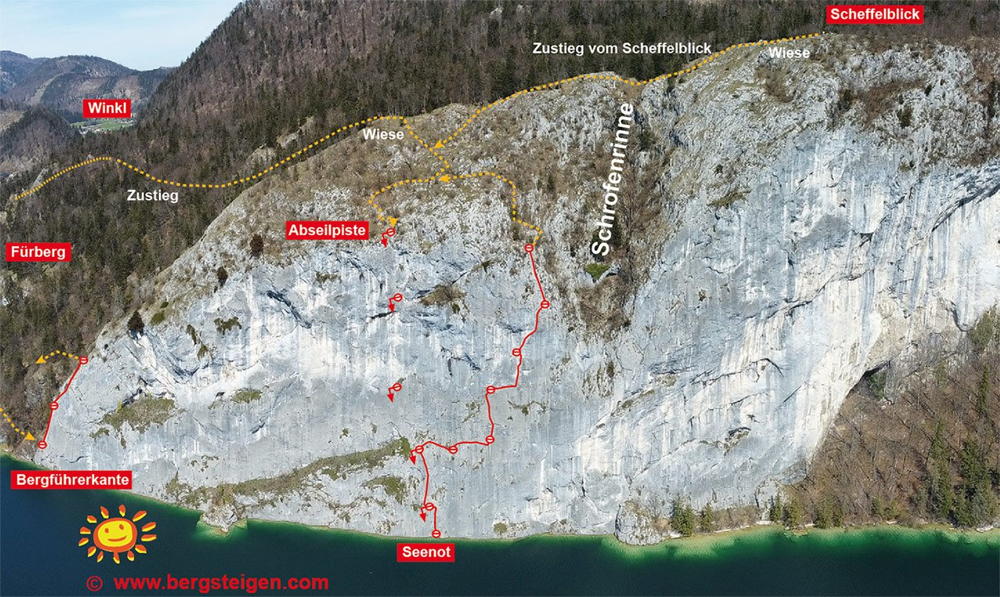
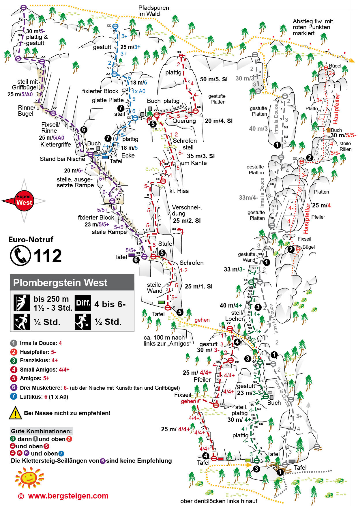
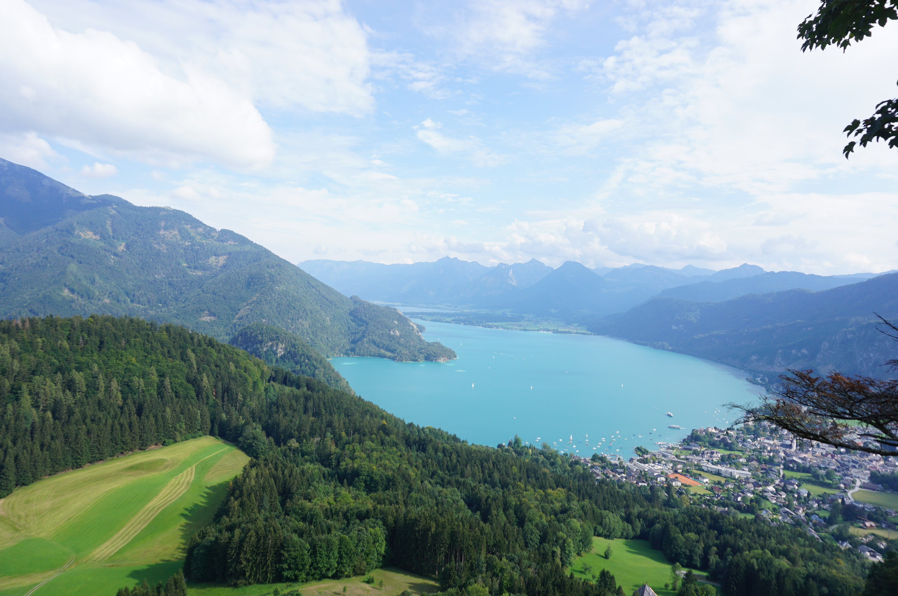
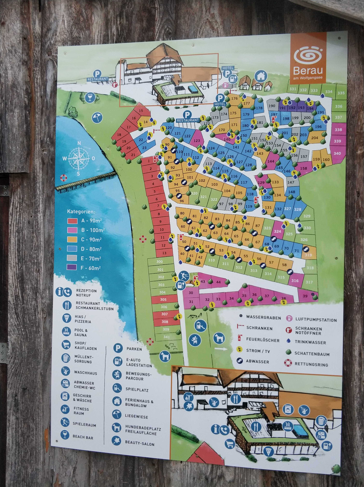
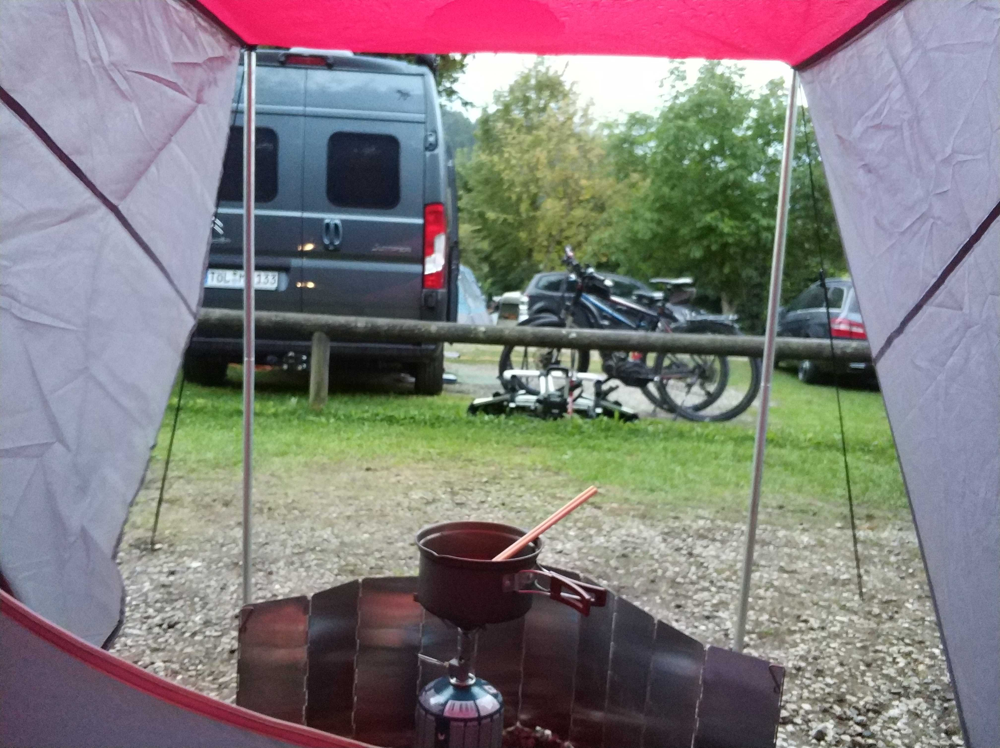
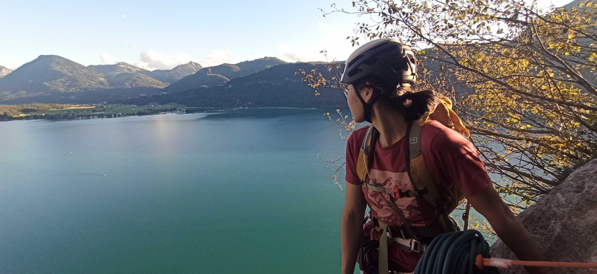

奥地利Wolfgangsee，在萨尔兹堡东边，离慕尼黑两个小时的车程。周围有Attersee, Mondsee等等，度假胜地，湖边有很多露营地。两年前来这边爬过几条铁索攀岩线路 -> 值得种草的奥地利铁索攀岩线路们，并且看上了湖边的一条结组攀岩线路。这回终于有机会拔草。

露营地几乎爆满，但幸好还是订上了周六晚的一个位置。周六先去爬了另外一条线热热身，图中标号4-5-6-7。Plombergstein接近性很好，但是岩壁上有些地方用人工点，人工脚踏来降低难度，不是特别喜欢这一点。

Plombergstein攀爬到顶后可以俯瞰Wolfgangsee

湖对面实拍周日要爬的岩壁

周六晚入住的豪华露营地，紧挨湖边，可以租小船，SUP，自行车。厕所，餐厅，充电桩，无线网络，泳池，桑拿一应俱全，洗澡间甚至有吹风机。很多家庭开着房车出来玩.

湖边逛了一圈，看天气不是很好，赶紧回来搭帐篷。刚在地上铺好野餐垫准备晚餐，结果就开始下雨了，只好躲到帐篷里接着煮泡面。

雨越下越大，完全没有要停的意思，还开始电闪雷鸣。因为时间紧凑，帐篷的外账搭得不是很好，有些直接贴着内帐的地方开始渗水。。。虽然有三个防潮垫，5个睡袋，还有被子和枕头，还是怕渗进来的水太多。一直在看手机的云图，等雨停。并且开始担心第二天还能不能爬了。

好在晚上十点到第二天都没有再下雨了。

图片

第二天早上悠闲收拾东西，顺便等岩壁变干一点。不过直到近距离看到线路之前都不能确定能不能爬，只能先过去，碰运气了。直接打道回府慕尼黑肯定是不甘心的。

详细线路信息请参考  -> [Bergsteigen网站](https://www.bergsteigen.com/touren/klettern/seenot)

这条线路有两种接近方式：先徒步到山上再绳降5次到湖边，或者让朋友划小船把你送到岩壁边。鉴于我们只有两个人，只能选择绳降了。

图片

绳降点不是特别好找，最好提前下载Bergsteigen上的GPS线路对着走。

图片

风景确实无敌！

图片

接着降

图片

图片

图片

湖面上都是划SUP的人

图片

我们借了朋友的80米单绳，发现绳子够长，最后两段就并成一段降了。最重要的点是，最后一段，最后一个人，一定，要沿线路挂一些快挂，把绳子挂到快挂里。不然抽绳的时候绳子很有可能掉水里 (～￣▽￣)～

到湖边了，一边换攀岩鞋一边看鱼的体验还是头一回。

图片

终于可以开始往上爬了！

图片

本来想着降到湖边吃午饭的，结果发现挂在那里不是很舒服，还是出发吧。

图片

图片

最爱的图，攀岩愣是攀出了无人机视角

图片

图片

第三四段的横移可以连成一段爬，可以用一些阿式延长挂，减少抽绳的阻力。

第四段的末尾有个7-，是整条线路的难点，要站在一个斜面slab上，两指洞换手。

当天只有我们两个人在爬，湖上看戏的人倒是不少。

因为早上出发的时候还是阴天，我甚至没有抹防晒霜。已经九月初了，但是一直被晒着还挺热的。

第六段是个夹角，有一些人工点，我一开始还不想用，后面发现不用的话实在太难了，上不去。。。

第七段也有很多人工点，有一些还坏了，或者会转，爬的时候要小心。

夕阳西下，爬最后一段~

到顶啦！

Wolfgangsee - Seenot 确实是爬过的很特殊的一条结组线路了，风景满分，线路风格也很丰富。

o(*￣▽￣*)ブ

当然，要是有朋友划小船就更好了 :)

两年前种的草终于成功拔出~

