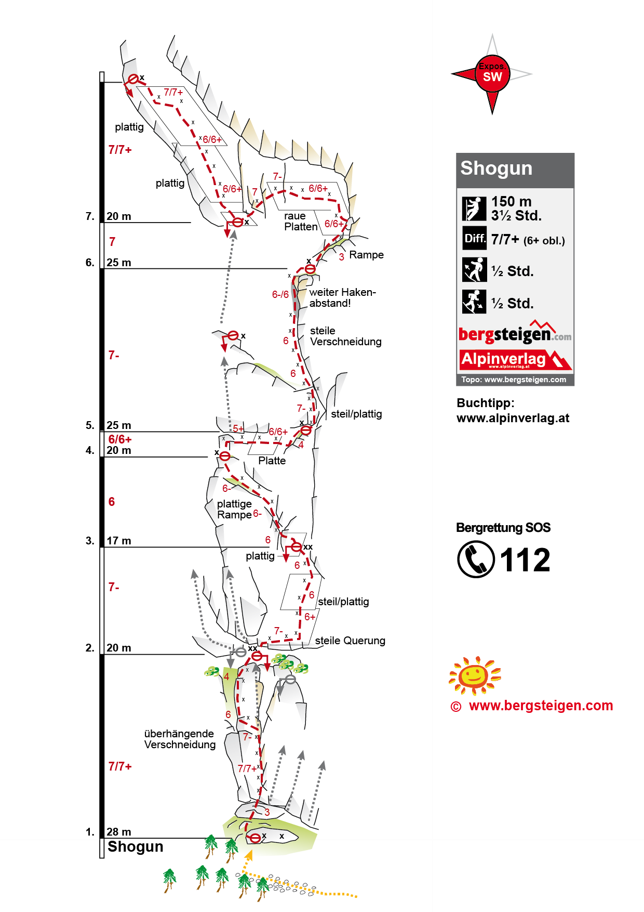
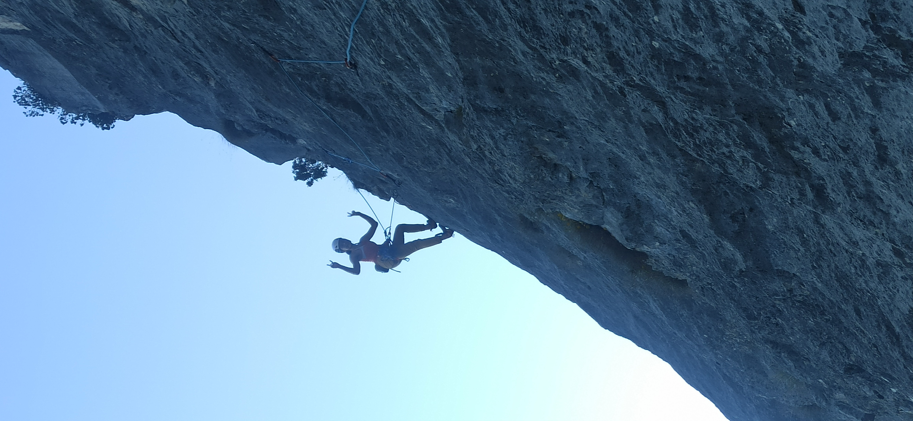

Chinesische Mauer（中国墙）是奥地利非常著名的岩场，线路偏难，基本上线路都是6a起的。岩壁一眼望去十分壮观。停车场走到岩壁需要半个小时左右。

晴朗的秋天最适合出来户外运动了。

早早的看上了一条多段-Shogun，7段，Bergsteigen上难度标的7+，the crag上面标的最后一段是8-。

因为到顶之后要绳降，所以我们把包和徒步鞋放在了起点，只用一个10升的小包装了3升的水袋。两人全程交替先锋，谁跟攀谁背小包。

第一段就是7+，我领攀，岩壁上线路很多，挂片也很多，可能会被误导。需要提前熟悉线路Topo。我爬的时候因为对线路不熟悉加上手臂有点涨，就take了几把才上去。

第二段的一开头的7-如果不知道动作还是挺难的。右手抓住一个还可以的点，左手要摸好高才能摸到好的点。

第三段爬完觉得绳子的摩檫力还不是很大，就把三四段连起来爬了。

第六段先往上爬，再横移，再往下爬。横移挺吓人的，不过岩壁很锋利，摩擦力很好。

最后一段的最后一把快挂和顶站之间是最难的，应该确实有8-，脚点很烂，而且容易开门。

耶，成功登顶！

因为最后一段是整个斜着往左边爬的，如果要绳降会十分麻烦，于是只有我爬了最后一段，搭档没有爬，我到顶之后按运动攀拆顶，然后被搭档放下来，还要斜着身子把快挂都收了，确实很艰难。

用了80米的绳子从倒数第二个顶开始绳降，一共绳降了三次。两个人绳降速度还是很快的，仅仅用了40分钟。

然后去找其他小伙伴爬运动攀Lolita Rechts (6b)

